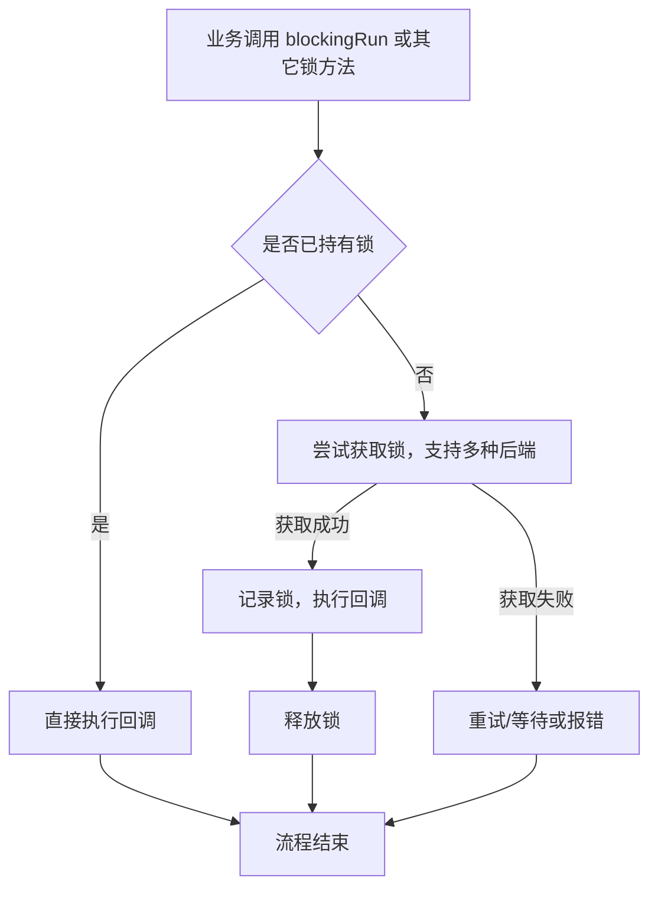

# Lock Service Bundle 工作流程（Mermaid）

```mermaid
flowchart TD
    A[业务调用 blockingRun 或其它锁方法] --> B{是否已持有锁}
    B -- 是 --> C[直接执行回调]
    B -- 否 --> D[尝试获取锁，支持多种后端]
    D -->|获取成功| E[记录锁，执行回调]
    D -->|获取失败| F[重试/等待或报错]
    E --> G[释放锁]
    C --> H[流程结束]
    G --> H
    F --> H
```

> 说明：
>
> - 支持多资源同时加锁，内部自动去重和排序。
> - 支持阻塞等待和重试机制。
> - 后端存储可选 Redis、数据库、文件等，由 SmartLockStore 自动切换。
